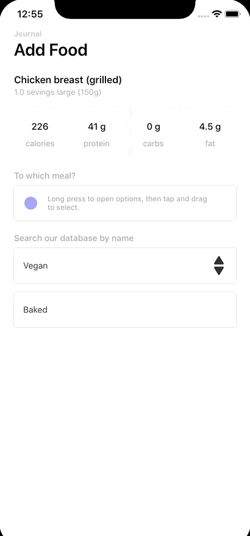

# Direct Select

<!--[](https://travis-ci.org/Swasidhant/DirectSelect)-->
[](https://cocoapods.org/pods/DirectSelect)
[](https://cocoapods.org/pods/DirectSelect)
[](https://cocoapods.org/pods/DirectSelect)
<!--[](https://twitter.com/Swasidhant7)-->

Based on Virgil Pana's <a href="https://dribbble.com/shots/3876250-DirectSelect-Dropdown-ux
">Direct select's</a> design:




## Requirements
- iOS 8.0+
- Xcode 10.0+
- Swift 5.0+

## Installation
Just add the DirectSelect directory to your project

Or use Cocoapods:

```ruby
pod 'DirectSelect'
```

## Usage
**1** Create an instance of DSInitialView from the `createInstance` method. Comply the intended delegate to `DSInitialViewDelegate`, which updates which option the user selected.
A data model of type `DSDataModel` has to be passed. This is here you pass the list of all options, initial option selected, various UI configurations, etc.

```swift
let initialView = DSInitialView.createInstance(model: giveDataModel1(), delegate: self)
```

**1.1** More details on the DSDataModel and what configurations are available:-

```swift
public class DSDataModel {
public class DSUIConfigs {
//should show an options expanding button on the initial view (See the second expanding view in the Example project)
public var showOptionsButton: Bool = false

//tintColor of the options button if its shown
public var optionsBtnColor: UIColor = UIColor.init(red: 34.0/255.0, green: 34.0/255.0, blue: 34.0/255.0, alpha: 1.0)

//font of the text on the initial view
public var initialFont: UIFont = UIFont.systemFont(ofSize: 14.0)

//font of the text on the rows of the final tableview
public var finalFont: UIFont = UIFont.systemFont(ofSize: 18.0)

//font of the title of final tableview view
public var finalTitleFont: UIFont = UIFont.systemFont(ofSize: 18.0)

//font color of the text on the initial view
public var initialFontColor: UIColor = UIColor.init(red: 34.0/255.0, green: 34.0/255.0, blue: 34.0/255.0, alpha: 1.0)

//font color of the text on the rows of the final tableview
public var finalFontColor: UIColor = UIColor.init(red: 34.0/255.0, green: 34.0/255.0, blue: 34.0/255.0, alpha: 1.0)

//background color of both the initial View and the final view cells and tableview
public var finalBGColor: UIColor = UIColor.white

//separator color of tableview
public var finalBGSeparatorColor: UIColor = UIColor.init(red: 243.0/255.0, green: 243.0/255.0, blue: 243.0/255.0, alpha: 1.0)

//font color of the title of final tableview view
public var finalTitleColor: UIColor = UIColor.init(red: 34.0/255.0, green: 34.0/255.0, blue: 34.0/255.0, alpha: 1.0)

//font color of the cell texts in non selection state
public var defaultSubviewNonSelectionColor: UIColor = UIColor.lightGray

//font of the cell title text in non selection state
public var finalTitleNonSelectionStateFont: UIFont = UIFont.systemFont(ofSize: 18.0)

//tableview row which is selected should first align itself exactly in the selectable area before the final tableview UI is dismissed
public var selectedRowShouldCenterBeforeDismiss: Bool = false

//UI configs of intro view if it is used
public var introViewUIModel: DSIntroUIModel?

public init() {

}
}

public init() {

}

//title to display on top of the final tableview
public var titleString: String?

//options to display on top of the final tableview. Type is [Any] as the even custom Subviews are allowed through DSSubview
public var values: [Any] = []

//time interval for which final tableview shows before auto dismissing
public var longPressDuration: TimeInterval = 1.0

//initial index which is selected by default in the tableview
public var initialIndex: Int = 0

//initial data which is shown by default in the tableview
public var initialData: Any?

//case defaultCell - we are using the default view for initial view and final view cells
//case customCell - we are custom view for initial view and final view cells
public var cellSubviewType: CSCellSubviewType = .defaultCell

//UI configs instance explained above
public var uiConfigs = DSUIConfigs()

//superview on which to add the final Tableview UI as subview
//if this is nil, we add the final Tableview UI to the superview of DSinitialView instance
//make this nil if the initial view is a direct subview of the view on which you need to present the final tableview UI
//other assign this property to the intended superview of the final tableview UI
public var finalViewSuperview: UIView?

//in case you are using custom subview, this block should return an instance of your custom subview
//we call this block when we want to initialize an instance of your subview.
//For assigning properties to your subview, we call assignData method of the DSSubview
public var customSubviewCreator: (() -> DSSubview)?
}
```

**2**  You can use an intro view to coach users on how to use DirectSelect. (See the first example of the FoodJournal Example). Just call `addAndShowIntroView()` on the `DSInitialView`. When you want to remove the intro call `removeIntroView()` on the same DSInitialView. As per current implementation, when user long presses on an initial view, we will remove the intro view (if present) and then show the final tableview ui.

**2.1** Configurations available on the intro view:

```swift
public class DSIntroUIModel {
//text to coach the user on how to use DirectSelect
public var introLabelText: String = "Long press to open options, then tap and drag to select."
//color of the text which coaches the user on how to use DirectSelect
public var introLabelColor: UIColor = UIColor.init(red: 150.0/255.0, green: 150.0/255.0, blue: 150.0/255.0, alpha: 1.0)
//backgroundColor of the circle view used in the intro screen
public var circleViewColor: UIColor = UIColor.blue.withAlphaComponent(0.4)
//backgroundColor of the halo effect used in the intro screen
public var haloColor: UIColor = UIColor.init(red: 140.0/255.0, green: 217.0/255.0, blue: 190.0/255.0, alpha: 1.0).withAlphaComponent(0.6)
}
```

**3** You can also use custom UI in the DSInitialView and in cells of the final tablview subview. Your custom subview should implement the protocol `DSSubview`. As an example check `giveDataModel4()` function in  `ViewController` class of the Example project. We use the custom UIView `CustomSubview` instead of the default view. Notice the line:

```swift
dataModel.customSubviewCreator = {DSSubview.createInstance()}
```

Here we assign the code creating an instance of the custom UIView to `customSubviewCreator` property of the dataModel

**3.1** DSSubview protocol methods are as follows:-

```swift
public protocol DSSubview: class {
var delegate: DSDefaultCellSubviewDelegate? {get set}

//callback when the subview enters the area of selection, (i.e. it enters between the two separator lines in the final tableview UI) you might want to make ui changes here
//For example, you might want to make the text font/color changes or background color changes
func wentInsideSelectionArea()

//callback when the subview goes outside the area of selection, (i.e. it enters outside the two separator lines in the final tableview UI) you might want to make ui changes here
func wentOutsideSelectionArea()

//give the list of views who size or position who want to change between the initial and final views
func giveViewsToAnimate() -> [UIView]

//this one's a bit tricky. So basically when we animate between different sizes between initial and final views, the spaces between the views will be different in the initial and final views
//so either you can give different constraints and return an array of CGFloat(0.0)s here (with length equal to the no of elements in giveViewsToAnimate())
//or you can return the values of how much to move the views in the x-coordinate space
func giveHorizontalTransformValues() -> [CGFloat]

//make the initial data and Ui setup of your subview
//DSInitialSetupViewType gives whether this subview instance is used in DSInitialView or DSFinalView
func initialSetup(_ data: Any?, viewType: DSInitialSetupViewType)

//make the data assignment
func assignData(_ data: Any?)

//give initial sizes of the views you want to be animated (you had passed them in giveViewsToAnimate())
//the order should be the same as the order of the views in giveViewsToAnimate()
func getInitialViewSizes(_ data: Any?) -> [CGSize]

//give final sizes of the views you want to be animated (you had passed them in giveViewsToAnimate())
//the order should be the same as the order of the views in giveViewsToAnimate()
func getFinalViewSizes(_ data: Any?) -> [CGSize]
}
```
**3.2** If we want to present the final view through some button click in our custom subview call the `showFinalViewAction()` of the `DSDefaultCellSubviewDelegate` protocol.

## Author

Swasidhant, ssprofessional33@gmail.com <br/>
<a href="https://twitter.com/Swasidhant7">Twitter</a>

## Note of Thanks

Special thanks to <a href="https://dribbble.com/Vraj247">Vikas Raj</a> for all his help with the design part. Could not have done it without the motivation, design help and criticism.

<a href="https://twitter.com/Vraj247">Twitter</a>

## License

CustomSelector is available under the MIT license. See the [LICENSE](./LICENSE) file for more info.

